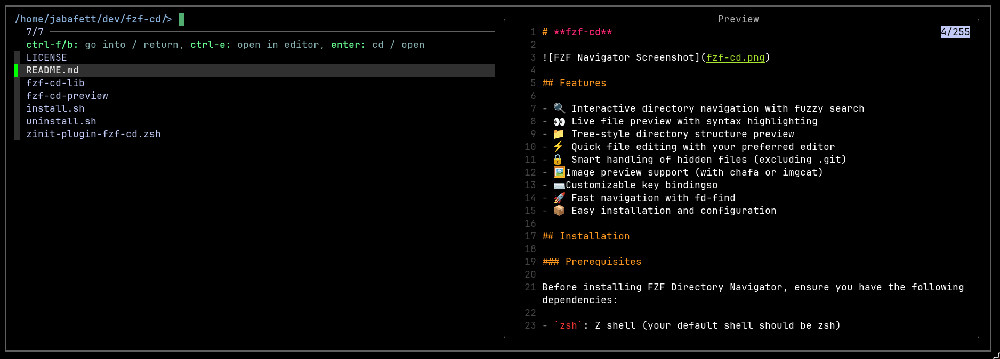
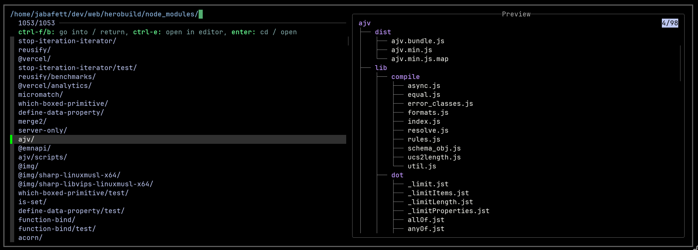

# **fzf-cd**





## Features

- 🔍 Interactive directory navigation with fuzzy search
- 👀 Live file preview with syntax highlighting
- 📁 Tree-style directory structure preview
- ⚡ Quick file editing with your preferred editor
- 🔒 Smart handling of hidden files (excluding .git)
- 🖼️ Image preview support (with chafa or imgcat)
- ⌨️ Customizable key bindings
- 🚀 Fast navigation with fd-find
- 📦 Easy installation and configuration

## Installation

### Prerequisites

Before installing FZF Directory Navigator, ensure you have the following dependencies:

- `zsh`: Z shell (your default shell should be zsh)
- `fzf`: Fuzzy finder for the core search functionality
- `fd`: Modern alternative to `find` for fast directory/file searching
- `bat`: Syntax highlighting for file previews
- `lsd`: Modern `ls` alternative for enhanced directory listings
- Optional but recommended:
  - `chafa`: Terminal graphics for image preview support
  - `imgcat`: Alternative image preview for iTerm2 users

Most dependencies can be installed via your package manager:

- On macOS with Homebrew
  ```bash
  brew install fzf fd bat lsd chafa
  ```
- On Ubuntu/Debian
  ```bash
  sudo apt install fzf fd-find bat lsd chafa
  ```
- On Arch Linux
  ```bash
  sudo pacman -S fzf fd bat lsd chafa
  ```

### Using Zinit

1. First ensure you have [Zinit](https://github.com/zdharma-continuum/zinit) installed.

2. Add the following to your `~/.zshrc`:

```bash
# Basic usage
zinit load jabafett/fzf-cd

# For turbo mode (faster startup)
zinit ice wait lucid
zinit load jabafett/fzf-cd

# Optional: Override the default keybinding
bindkey '^g' ___fzf_cd  # Changes binding to Ctrl+G
```

The plugin will automatically:

- Install and configure all required dependencies (fzf, fd, bat, lsd)
- Set up the necessary scripts and completions
- Configure the default keybinding (Ctrl+F)

After adding the configuration:

```bash
# Reload your shell
source ~/.zshrc

# Or install/update the plugin directly
zinit update jabafett/fzf-cd
```

### Automatic Installation

1. Clone the repository:

   ```bash
   git clone https://github.com/jabafett/fzf-cd.git
   ```

2. Navigate to the cloned directory:

   ```bash
   cd fzf-cd
   ```

3. Run the installation script:

   ```bash
   ./install.sh
   ```

4. Follow the prompts to configure your preferred key binding (default: Ctrl+F)

5. Restart your shell or run:
   ```bash
   source ~/.zshrc
   ```

### Manual Installation

1. Create the necessary directories:

   ```bash
   mkdir -p ~/.local/bin ~/.local/lib/fzf-cd
   ```

2. Copy the scripts to their locations:

   ```bash
   cp fzf-cd ~/.local/bin/
   cp fzf-cd-lib ~/.local/lib/fzf-cd/
   cp fzf-cd-preview ~/.local/lib/fzf-cd/
   ```

3. Make the scripts executable:

   ```bash
   chmod +x ~/.local/bin/fzf-cd
   chmod +x ~/.local/lib/fzf-cd/fzf-cd-lib
   chmod +x ~/.local/lib/fzf-cd/fzf-cd-preview
   ```

4. Add the following configuration to your `~/.zshrc`:
   ```zsh
   # Fuzzy Directory Navigator Configuration
   fzf-cd-my-widget() {
     BUFFER="fzf-cd"
     zle accept-line
   }
   zle -N fzf-cd-my-widget
   bindkey '^f' fzf-cd-my-widget  # Change '^f' to your preferred key binding
   ```

## Usage

### Basic Navigation

1. Press `Ctrl+F` (or your configured key binding) to launch the navigator.
2. Type to fuzzy search directories.
3. Use arrow keys to move selection.
4. Press `Enter` to change to the selected directory.

### Advanced Features

- **File Preview**: Preview files with syntax highlighting in the right panel.
- **Directory Preview**: See directory structure in tree format (up to 5 levels deep).
- **Image Preview**: Preview images directly in the terminal (requires chafa or imgcat).
- **Theme Support**: Automatically adapts to light/dark terminal themes.

### Keyboard Shortcuts

| Shortcut       | Action                     |
| -------------- | -------------------------- |
| `Ctrl+F`       | Navigate into directory    |
| `Ctrl+B`       | Navigate back              |
| `Ctrl+E`       | Open file in editor        |
| `Enter`        | Change directory/Open file |
| `Ctrl+C`/`Esc` | Exit navigator             |
| `Ctrl+K`/`P`   | Move up the list           |
| `Ctrl+J`/`N`   | Move down the list         |
| `Ctrl+U`       | Scroll preview up          |
| `Ctrl+D`       | Scroll preview down        |
| `Ctrl+H`       | Toggle hidden files        |

### Command Line Options

```bash
fzf-cd [options] [directory]
Options:
-h Display help message
Arguments:
directory Starting directory (default: current directory)
```

## Customization

### Changing the Default Editor

The navigator uses the `$EDITOR` environment variable. Set it in your `~/.zshrc`:

```bash
export EDITOR='nvim' # or 'vim', 'code', etc.
```

### Preview Customization

Modify preview behavior by setting environment variables:

```bash
export BAT_STYLE="numbers,changes" # Customize bat preview style
export FZF_PREVIEW_COLUMNS=80 # Set preview width
```

### Environment Variables

You can customize the behavior by setting these environment variables:

```bash
export EDITOR='nvim'  # Set your preferred editor
export BAT_STYLE="numbers"  # Customize bat preview style
export FZF_THEME="dark"    # Set to "light" for light terminal themes
```

## Uninstallation

To remove FZF Directory Navigator:

```bash
./uninstall.sh
```

This will:

- Remove all installed scripts
- Clean up configuration from `~/.zshrc`
- Remove created directories

## Troubleshooting

### Common Issues

1. **Command not found**: Ensure `~/.local/bin` is in your PATH.
2. **Preview not working**: Check if bat and lsd are installed.
3. **Image preview fails**: Verify chafa or imgcat installation.

## License

This project is licensed under the MIT License - see the [LICENSE](LICENSE) file for details.

## Acknowledgements

- [fzf](https://github.com/junegunn/fzf) - Goat fuzzy finder
- [bat](https://github.com/sharkdp/bat) - Modern cat
- [fd](https://github.com/sharkdp/fd) - Modern find
- [lsd](https://github.com/lsd-rs/lsd) - Modern ls
- [chafa](https://github.com/hpjansson/chafa) - Image to ASCII converter
